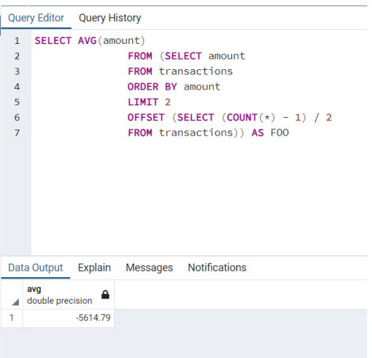
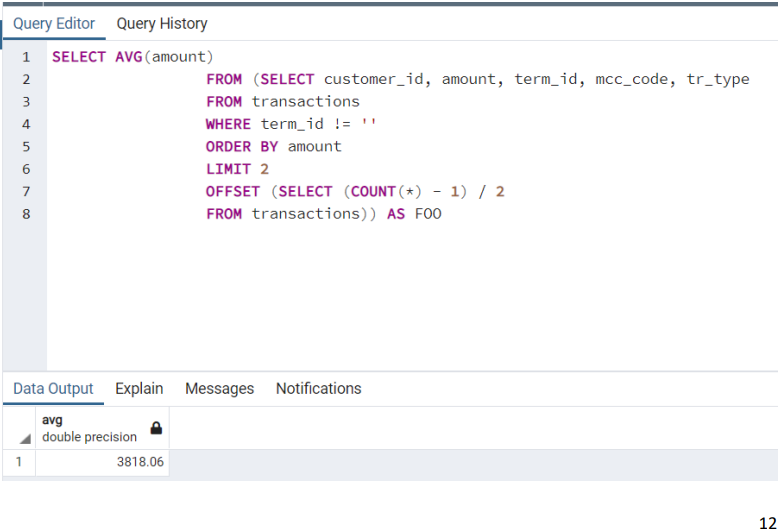
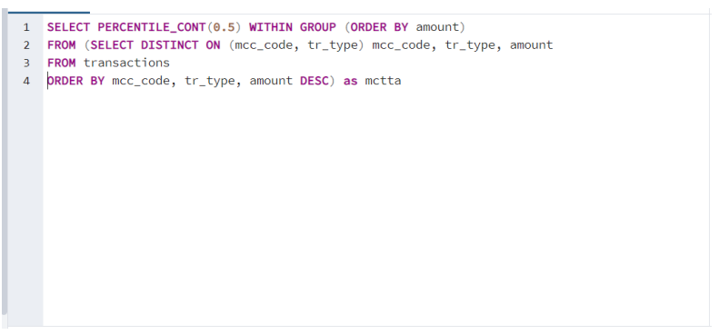

# CSV_Reader
## Config
   Специальный класс, которые передает в DBService необходимые параметры для
   входа в базу данных : URL, user, password
## DBService
   Класс, в котором хранятся методы для работы с БД:
   Create_Table() – метод для создании таблицы
   Table_fill() – метод для заполнения таблицы информацией из базы данных
   Calculate_median_value() – метод для расчета медианного значения с помощью SQL
   запросов, возвращает переменную типа String median_value
## Main
   Исполняемый файл, хранится один метод:
   main(String[] args) – метод для работы с пользователем через консоль и вызова
   методов из других классов
## Work_With_CSV
   Класс, в котором хранятся методы для работы с csv файлами:
   Input() – метод принимающий и возвращающий путь к csv файлу
   Readcsv(String path) – метод, который считывает данные из csv файла и возвращает
   их в виде массива
   WriteCSV(String median_value)
   Файл, записывающий ответ в csv файл
   ## Расчет медианного значения
В программе представлено три способа расчета медианного значения :
• обычный поиск по всем значениям (стандартное поведение);
• поиск по тем строкам, которые ни в одном из своих столбцов не содержат пустые
значения;
• Медиана суммы транзакций по строкам, отсортированным по полю amount в
порядке возрастания, и из которых удалены дублирующиеся по столбцам
12
[mcc_code, tr_type] строки, причём при удалении соответстующих дублей остаются
только последние из дублирующихся строк;

### Для обычного поиска по всем значениям написан следующий SQL запрос :

### Для поиска по тем строкам, которые ни в одном из своих столбцов не содержат пустые значения был написан следующий SQL запрос :

### Для расчета медианы суммы транзакций по строкам, отсортированным по полю amount в порядке возрастания, и из которых удалены дублирующиеся по столбцам [mcc_code, tr_type] строки, причём при удалении соответстующих дублей остаются только последние из дублирующихся строк был написан следующий запрос :
